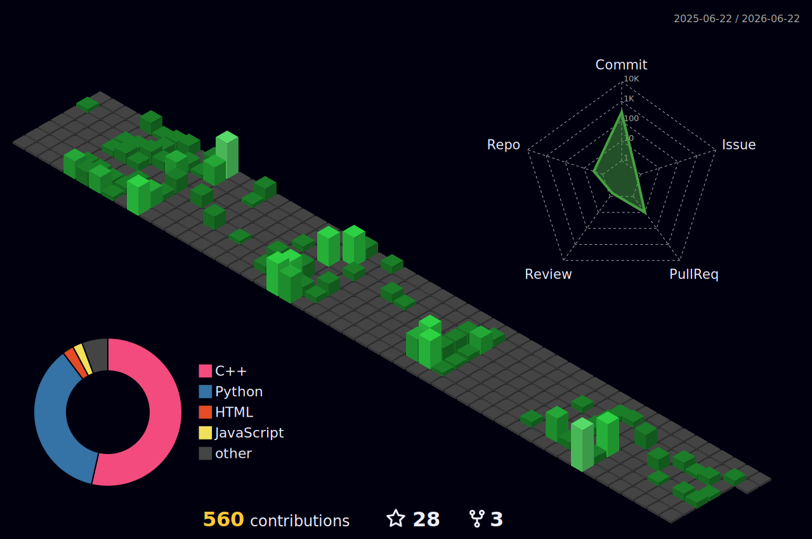

 
# Jihoon Kim (jihoonkimtech)

A **passionate student** of **Computer engineering** *(I'm trying to be)* 
I like Embedded System, MCUs, **make something using all 'Engineering' things**
 

## My Tech Stacks
<!-- badge: shields.io, logo: simpleicons.org -->
### MCUs

### Programming Languages

### Sheet/Script Languages

### Development Boards

### Operating Systems

### CADs

### Co-op Tools

### IDEs

## Extra Information
 

━┥[**My Portfolio**](https://jihoonkimtech.github.io/) ┝━┥
[**My Tech Blog**](https://jihoonkimtech.tistory.com/)┝━
  

  
  

